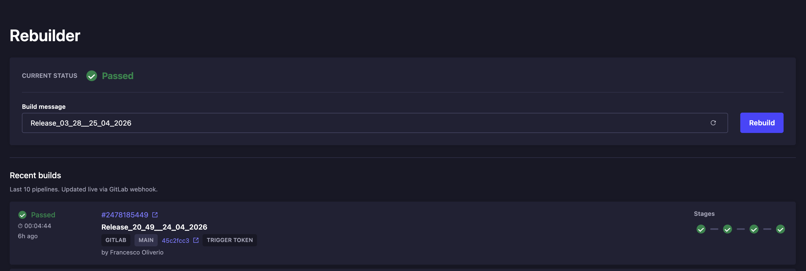

# Strapi Plugin Rebuilder

> Rebuild your **Next.js SSR / SSG / ISR** site from the Strapi admin panel — one click, live status, full history. Works with **GitLab CI** and **GitHub Actions**.

[](https://www.npmjs.com/package/@francescoliverio/strapi-plugin-rebuilder)
[](https://www.npmjs.com/package/@francescoliverio/strapi-plugin-rebuilder)
[](LICENSE)
[](https://strapi.io)
[](https://strapi.io)
[](https://nextjs.org)
[](https://docs.gitlab.com/ci/)
[](https://docs.github.com/en/actions)
[](https://www.typescriptlang.org)



A Strapi plugin that adds a **Rebuild** button inside the admin panel so editors can rebuild and redeploy a **Next.js** site without leaving Strapi.

It's the missing link between **Strapi as a headless CMS** and a **Next.js SSR / SSG / ISR** front-end: editors update content, click **Rebuild**, and the static site or server-rendered app gets regenerated with the latest data. Works with both **GitLab pipelines** and **GitHub Actions workflows** behind the same UI.

## Features

- 🚀 One-click rebuild — perfect for **Next.js** sites that need a redeploy after content changes
- ⚡ Works for **SSR**, **SSG** and **ISR** Next.js apps (rebuild the whole site or hit a revalidate endpoint from CI)
- 🏷️ Custom build label (becomes the pipeline name in CI)
- 👤 Captures the admin user as `TRIGGERED_BY`
- 📡 Live status via webhooks — no manual refresh
- 📜 Recent builds with provider, status, duration, commit and stage graph
- 🔌 Pluggable provider: **GitLab** (trigger token) or **GitHub Actions** (`workflow_dispatch`)

## How it works

1. An admin clicks **Rebuild** in Strapi, optionally adding a build message.
2. The plugin calls the configured provider — GitLab trigger API or GitHub `workflow_dispatch`.
3. The provider runs the pipeline and posts webhook updates back to Strapi.
4. The plugin verifies the webhook, normalizes it, and the UI shows the new status live.

## Install

The plugin is published on **[npmjs.com](https://www.npmjs.com/package/@francescoliverio/strapi-plugin-rebuilder)** — no auth, no private registry, just:

```bash
npm install @francescoliverio/strapi-plugin-rebuilder
# or
yarn add @francescoliverio/strapi-plugin-rebuilder
# or
pnpm add @francescoliverio/strapi-plugin-rebuilder
# or
bun add @francescoliverio/strapi-plugin-rebuilder
```

If you plan to use the **GitHub Actions** provider, enable raw body access in `config/middlewares.ts` (required for webhook signature verification):

```ts
{
  name: "strapi::body",
  config: { includeUnparsed: true },
}
```

Strapi v4 and v5 are both supported (see the compatibility badges above).

## Configure

Pick a provider via `NEXJS_REBUILDER_PROVIDER` (`gitlab` or `github`, default `gitlab`). Ready-to-copy `.env` templates live in [`examples/`](examples/).

### GitLab → [`examples/.env.gitlab.example`](examples/.env.gitlab.example)

| Variable | Required | Description |
| --- | --- | --- |
| `NEXJS_REBUILDER_GITLAB_PROJECT_ID` | ✅ | GitLab project ID |
| `NEXJS_REBUILDER_GITLAB_TRIGGER_TOKEN` | ✅ | Pipeline trigger token |
| `NEXJS_REBUILDER_GITLAB_WEBHOOK_SECRET` | ✅ | Validated against `X-Gitlab-Token` |
| `NEXJS_REBUILDER_GITLAB_REF` | — | Branch/ref. Default: `main` |
| `NEXJS_REBUILDER_GITLAB_API_BASE_URL` | — | For self-managed GitLab |

### GitHub → [`examples/.env.github.example`](examples/.env.github.example)

| Variable | Required | Description |
| --- | --- | --- |
| `NEXJS_REBUILDER_GITHUB_OWNER` | ✅ | Repository owner |
| `NEXJS_REBUILDER_GITHUB_REPO` | ✅ | Repository name |
| `NEXJS_REBUILDER_GITHUB_WORKFLOW_ID` | ✅ | Workflow filename (e.g. `deploy.yml`) |
| `NEXJS_REBUILDER_GITHUB_TOKEN` | ✅ | Token with Actions write |
| `NEXJS_REBUILDER_GITHUB_WEBHOOK_SECRET` | ✅ | Verified via `X-Hub-Signature-256` |
| `NEXJS_REBUILDER_GITHUB_REF` | — | Branch/tag. Default: `main` |

### Set up the webhook

The plugin **triggers** pipelines through GitLab/GitHub APIs, but it needs a **webhook back** to know when those pipelines start, succeed or fail. Without the webhook, the Rebuilder UI would never update after you click Rebuild.

You configure this once, on the side of GitLab or GitHub, pointing to your Strapi instance.

**The webhook URL is always:**

```text
https://your-strapi-domain.com/api/nexjs-rebuilder/webhook
```

Replace `your-strapi-domain.com` with the public URL of your Strapi server. The endpoint is intentionally public (GitLab/GitHub need to reach it), but every request is verified against the secret you set in your `.env` — so only your CI provider can post to it.

#### GitLab

1. Open your project on GitLab → **Settings → Webhooks**.
2. **URL**: paste the webhook URL above.
3. **Secret token**: paste the same value you used for `NEXJS_REBUILDER_GITLAB_WEBHOOK_SECRET`. GitLab sends it as the `X-Gitlab-Token` header and the plugin validates it on every call.
4. Under **Trigger**, enable **Pipeline events** (this is what tells the UI a pipeline started/succeeded/failed).
5. Keep **SSL verification** on for production.
6. Save the webhook. You can use the **Test** button to send a fake payload and check it arrives.

Docs: [GitLab webhooks](https://docs.gitlab.com/user/project/integrations/webhooks/)

#### GitHub

1. Open your repo on GitHub → **Settings → Webhooks → Add webhook**.
2. **Payload URL**: paste the webhook URL above.
3. **Content type**: `application/json`.
4. **Secret**: paste the same value you used for `NEXJS_REBUILDER_GITHUB_WEBHOOK_SECRET`. GitHub signs every request with it via `X-Hub-Signature-256` and the plugin verifies the signature.
5. Under **Which events would you like to trigger this webhook?**, choose **Let me select individual events** and enable:
   - **Workflow runs** — fires when the whole workflow starts/completes (drives the top-level status).
   - **Workflow jobs** — fires for each job inside the workflow (drives the stage graph in the UI).
6. Make sure the webhook is **Active** and save.

Important: GitHub signature verification needs Strapi's body middleware to expose the raw request body. Make sure `config/middlewares.ts` has `includeUnparsed: true` (see the [Install](#install) section).

Docs: [GitHub webhooks](https://docs.github.com/en/webhooks/webhook-events-and-payloads) · [validating deliveries](https://docs.github.com/en/webhooks/using-webhooks/validating-webhook-deliveries)

## Example pipelines

Two ready-to-use CI files live in [`examples/`](examples/) — copy them into your Next.js (or any) repo and tweak the deploy steps.

### GitLab → [`examples/gitlab-ci.yml`](examples/gitlab-ci.yml)

Drop it at the root of your repo as `.gitlab-ci.yml`. The plugin sends two variables you can use:

- **`BUILD_MESSAGE`** — the label the editor typed in Strapi
- **`TRIGGERED_BY`** — the Strapi admin who clicked Rebuild

Snippet — naming the pipeline after the editor's message:

```yaml
workflow:
  name: "$PIPELINE_NAME"
  rules:
    - if: '$CI_PIPELINE_SOURCE == "trigger" && $BUILD_MESSAGE'
      variables:
        PIPELINE_NAME: "$BUILD_MESSAGE"
    - when: always
      variables:
        PIPELINE_NAME: "$CI_COMMIT_TITLE"
```

GitLab docs: [pipeline triggers](https://docs.gitlab.com/ci/triggers/) · [trigger token API](https://docs.gitlab.com/api/pipeline_triggers/) · [webhook events](https://docs.gitlab.com/user/project/integrations/webhook_events/)

### GitHub Actions → [`examples/github-actions-deploy.yml`](examples/github-actions-deploy.yml)

Drop it in your repo at `.github/workflows/deploy.yml`, then point Strapi at it:

```env
NEXJS_REBUILDER_PROVIDER=github
NEXJS_REBUILDER_GITHUB_WORKFLOW_ID=deploy.yml
```

The plugin dispatches the workflow with two inputs. **Your workflow must declare them** or GitHub will reject the dispatch:

```yaml
name: Deploy
run-name: ${{ inputs.build_message || github.event.head_commit.message || github.workflow }}

on:
  workflow_dispatch:
    inputs:
      build_message:
        type: string
      triggered_by:
        type: string
```

GitHub docs: [`workflow_dispatch`](https://docs.github.com/en/actions/how-tos/managing-workflow-runs-and-deployments/managing-workflow-runs/manually-running-a-workflow) · [REST API](https://docs.github.com/en/rest/actions/workflows) · [validating webhooks](https://docs.github.com/en/webhooks/using-webhooks/validating-webhook-deliveries)

## Troubleshooting

- **Rebuild returns 500** — check your provider env vars.
- **GitHub dispatch fails** — the workflow must exist on the selected ref and accept the `build_message`/`triggered_by` inputs.
- **GitHub webhook signature invalid** — make sure `includeUnparsed: true` is set in `config/middlewares.ts`.
- **GitLab pipeline never starts** — your CI rules may block `CI_PIPELINE_SOURCE == "trigger"`.
- **UI doesn't update** — verify the webhook URL is reachable and the secret matches.

## Contributors

Thanks to everyone who has helped shape this plugin.

- [Alex Zaganelli](https://github.com/alexzaganelli)

## License

This plugin is released under the **[MIT License](LICENSE)** — free to use, modify and distribute, including for commercial use. The only requirement is to keep the copyright notice intact.

```
Copyright (c) 2026 Francesco Oliverio
```

See the full license text in [LICENSE](LICENSE).
